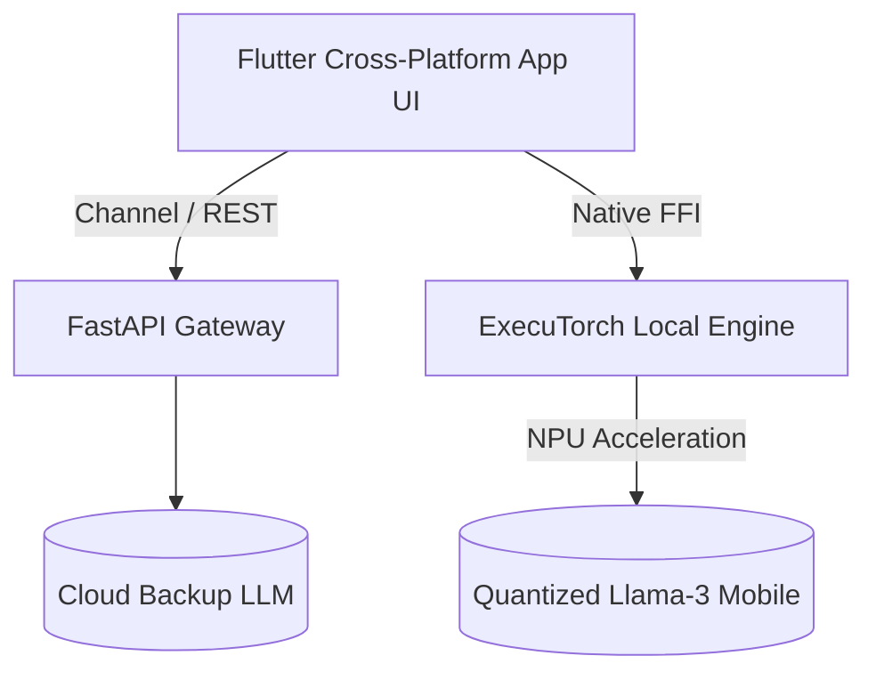

# AI_Powered_Flutter_Mobile_App

Cross-platform Flutter mobile application integrating on-device ExecuTorch / MediaPipe LLM inference with FastAPI backend synchronization.

## Architecture & System Flowchart



## Directory Structure

```
AI_Powered_Flutter_Mobile_App/
├── src/           # Backend AI Core & Logic
├── lib/ / app/    # Mobile UI / Web Frontend
├── tests/         # Unit Test Suite
├── app.py         # FastAPI Gateway Application
├── Dockerfile     # Container Configuration
├── requirements.txt
└── LICENSE
```

## Quick Start

```bash
# Install dependencies
pip install -r requirements.txt

# Run backend API
python app.py

# Run tests
pytest tests/ -v

# Container deployment
docker build -t ai_powered_flutter_mobile_app .
docker run -p 8000:8000 ai_powered_flutter_mobile_app
```


---

## Author & Licensing

**Author:** Muhammad Ibrahim  
**Email:** [ukibrahim111@gmail.com](mailto:ukibrahim111@gmail.com)  
**GitHub:** [https://github.com/ibrahimuk111](https://github.com/ibrahimuk111)  
**License:** MIT License - Copyright (c) 2026 Muhammad Ibrahim

If you find this project useful, please consider giving it a star and connecting with me for collaborations.

