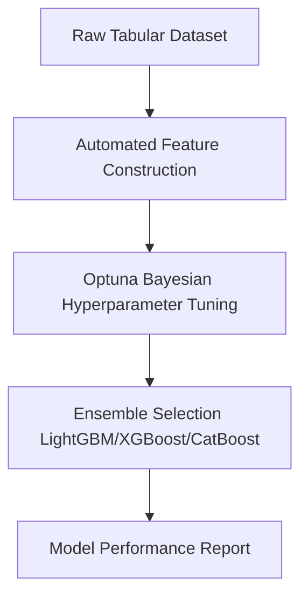

# AutoML_Feature_Engineering_Engine

Automated Feature Engineering and AutoML optimization engine utilizing Optuna Bayesian search and gradient boosted decision trees.

## System Architecture



## Directory Structure

```
AutoML_Feature_Engineering_Engine/
├── src/           # Core modules
├── tests/         # Unit tests (pytest)
├── app.py         # Application entry point
├── Dockerfile     # Container configuration
├── requirements.txt
└── LICENSE
```

## Quick Start

```bash
# Install dependencies
pip install -r requirements.txt

# Run application
python app.py

# Run tests
pytest tests/ -v

# Container build
docker build -t automl_feature_engineering_engine .
docker run -p 8000:8000 automl_feature_engineering_engine
```


---

## Author & Licensing

**Author:** Muhammad Ibrahim  
**Email:** [ukibrahim111@gmail.com](mailto:ukibrahim111@gmail.com)  
**GitHub:** [https://github.com/ibrahimuk111](https://github.com/ibrahimuk111)  
**License:** MIT License - Copyright (c) 2026 Muhammad Ibrahim

If you find this project useful, please consider giving it a star and connecting with me for collaborations.

